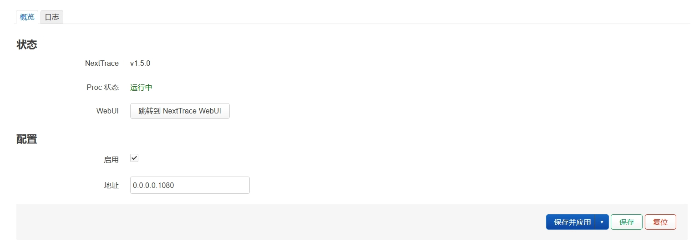
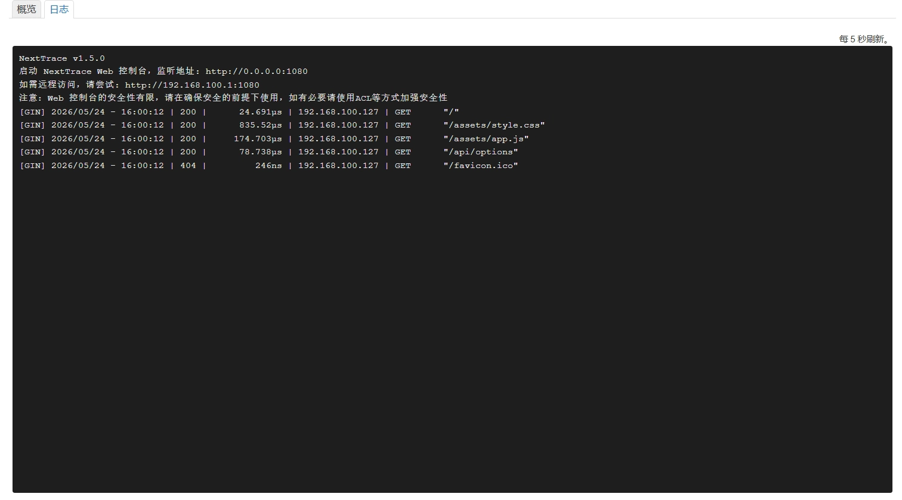

# luci-app-nexttrace
简单管理 OpenWrt 上的 [NextTrace](https://github.com/nxtrace/NTrace-core) WebUI。

---
## 安装与使用

### 从源码编译

```sh
# 拉取源码
git clone https://github.com/httSlayQueen/luci-app-nexttrace.git package/luci-app-nexttrace

# Menuconfig：LuCI -> Applications
make menuconfig

make package/luci-app-nexttrace/compile V=s
```

### 使用

可在 `服务 -> NextTrace` 找到管理界面，勾选“启用”并点击“保存并应用”后，若进程状态正常即可点击按钮进入WebUI

### 注意事项

1. 若使用 Openwrt 25.12 以上版本，即使用 `apk` 为软件包管理器的版本，请在安装时添加参数 `--allow-untrusted` 

2. 若使用 OpenClash 等软件的 `Fake-IP` 模式，请勿在 NextTrace WebUI 的目标地址中填写域名，否则会导致 nexttrace 服务进程重启或返回错误结果；请自行寻找让 nexttrace 绕过科学内核的方式，或使用 `Real-IP`

3. 请在使用完毕后点击【停止】终止 nexttrace 后台服务，否则它将向 PoW 服务器每秒请求一次；也可以将 PoW 域名添加到直连规则内（默认域名 `api.nxtrace.org`）

---
## 截图




